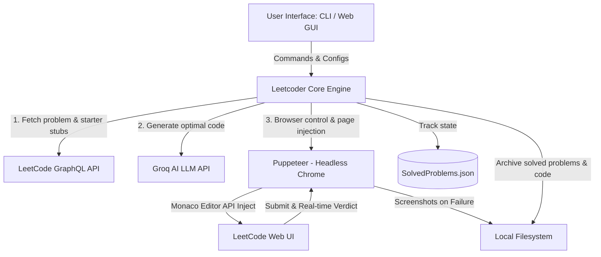

# 🚀 Leetcoder

<p align="center">
  
  
  
  
  
</p>

<p align="center">
  <strong>Automate login, optimal solution generation, web submissions, and solution scraping on LeetCode.</strong>
</p>

> [!IMPORTANT]  
> **Educational & Research Purpose Only**  
> This project was developed as a case study in system design to explore browser automation, Monaco Editor scripting, real-time logging architectures, and Large Language Model (LLM) orchestration. It is strictly intended for educational, personal archive, and research purposes. Do not use this tool to misrepresent progress or automate active contest submissions. Always respect [LeetCode's Terms of Service](https://leetcode.com/terms/).

---

## 📖 Overview

**Leetcoder** is an AI-powered automation agent and developer tool that handles LeetCode logins, problem solving, submission verifications, and scraping. By combining **Puppeteer** for browser control, the **LeetCode GraphQL API** for problem details, and **Groq LLM** APIs for optimal code generation, Leetcoder can solve and archive up to ~200 problems per hour under stable network conditions.

Manage everything from a sleek **CLI interactive interface** or a **Local Web Dashboard** showing real-time logs streamed via Server-Sent Events (SSE).

---

## 📐 Architecture & Flow



---

## ✨ Features

- **🤖 AI-Driven Solutions**: Fetches problem descriptions and exact compiler starter stubs from LeetCode. Feeds them to Groq APIs (supporting state-of-the-art models like Llama 3) to generate solutions optimized for time and space complexity.
- **🌐 Advanced Browser Automation**: Automates standard actions inside LeetCode's dynamic user interface:
  - Bypasses traditional keyboard delays by injecting solutions directly into the online Monaco Editor via its JavaScript API.
  - Automatically clicks and switches language runtimes.
  - Waits for button states and processes real-time submission verdicts (`Accepted` / `Runtime Error` etc.).
- **📊 Real-time Web Dashboard**: Includes a built-in Node.js HTTP server. The UI streams terminal execution logs dynamically using **Server-Sent Events (SSE)**. You can start/stop the execution and configure runtime settings directly from `http://localhost:3000`.
- **📂 Bulk Solution Scraper**: Scrapes and formats previously accepted solutions from your LeetCode history and saves them to a clean folder structure.
- **📸 Visual Debugging & Safety**: Supports resumption from crash states (uses local JSON databases to keep track of completed questions). If a submission fails, it captures a screenshot (`error_[problem-slug].png`) to help debug UI or logical mismatch issues.

---

## 🛠️ Configuration Settings

Configure your application by creating a `.env` file in the root directory. Here are the available variables:

| Variable | Description | Default / Example |
| :--- | :--- | :--- |
| `USER_EMAIL` | Unique identifier used to partition Chrome profiles and solution databases on disk. | `your_email@gmail.com` |
| `GOOGLE_CHROME_EXECUTABLE_PATH` | Absolute path to the Google Chrome binary on your Windows system. | `C:/Program Files/Google/Chrome/Application/chrome.exe` |
| `GROQ_API_KEY` | Your personal API key for Groq Cloud. *(Required for mode 1 & Dashboard solver)* | `gsk_...` |
| `GROQ_MODEL` | LLM model used to generate solutions. | `llama-3.3-70b-versatile` |
| `USE_GROQ_AI` | Flag to toggle AI solution generation on or off. | `true` |
| `PROBLEM_PICK_MODE` | Selection pattern. Options: `random`, `sequential`, or `single`. | `random` |
| `SINGLE_PROBLEM_NAME` | LeetCode problem slug to solve if `PROBLEM_PICK_MODE` is set to `single`. | `two-sum` |

---

## 🚀 Getting Started

### Prerequisites

- **Node.js** version 18 or above.
- **Google Chrome** browser installed on a Windows machine.

### Installation

1. **Clone the repository**:
   ```bash
   git clone <repository_url>
   cd leetcoder
   ```

2. **Install dependencies**:
   ```bash
   yarn install
   # or
   npm install
   ```

3. **Set up configurations**:
   Create a `.env` file in the root directory and define your settings:
   ```env
   USER_EMAIL=your_email@example.com
   GOOGLE_CHROME_EXECUTABLE_PATH=C:/Program Files/Google/Chrome/Application/chrome.exe
   GROQ_API_KEY=your_groq_api_key_here
   GROQ_MODEL=llama-3.3-70b-versatile
   USE_GROQ_AI=true
   PROBLEM_PICK_MODE=random
   ```

---

## 💻 How to Use

Run the startup script:
```bash
yarn start
# or
npm start
```

You will be presented with interactive choices:

```text
Select a mode:
[L] Login to LeetCode (do this first / whenever your session expires).
[1] Start Leetcode Bot.
[2] Scrape Solved Leetcode Problems.
[G] Start Web GUI Dashboard.
```

### 1️⃣ First Run: Authenticate
1. Run the script and choose **`L`**.
2. A Chrome window opens displaying the LeetCode Login page.
3. Log in manually. Once logged in successfully, **close the Chrome window**.
4. Your credentials and session cache are stored securely in `./UserData/[USER_EMAIL]/ProfileData`. You will not need to log in again until the session cookies expire.

### 2️⃣ Running CLI Modes
- **`1` (Solve Mode)**: Automates the AI-generation and submission loop for LeetCode questions.
- **`2` (Scrape Mode)**: Scrapes all of your successfully accepted solutions and saves them locally.

### 3️⃣ Running GUI Dashboard Mode
Run the script and select **`G`** (or let it launch automatically on port 3000 in the background).
1. Open your browser and navigate to **`http://localhost:3000`**.
2. View and update system configurations on the fly (saves back to `.env`).
3. Click **Start Solver** / **Stop Solver** to toggle the Puppeteer runner.
4. Watch console output stream in real-time in the dashboard log viewer.

---

## 📂 Project Structure & Storage Paths

All dynamic profiles, databases, and scraped solutions are isolated under the `./UserData` folder matching your configured `USER_EMAIL`:

```text
UserData/
└── [your_email@example.com]/
    ├── ProfileData/            <-- Caches Chrome cookies, local storage & session state
    └── LeetcoderData/
        ├── SolvedProblems.json <-- Database listing completed/skipped slugs
        └── ScrapedSolutions/   <-- Output folder containing archived solutions
```

---

## 📄 License

This project is licensed under the [MIT License](LICENSE).
